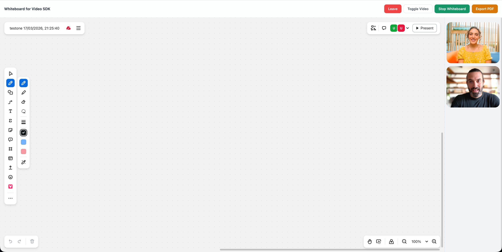

# Zoom Video SDK Web Whiteboard Sample

Use of this sample app is subject to our [Terms of Use](https://explore.zoom.us/en/video-sdk-terms/).

Video SDK Web sample app with whiteboard functionality. It shows joining a session, starting/stopping a live whiteboard presentation, viewing a presenter's whiteboard, and exporting the whiteboard to PDF.



## Installation

Clone the repo and install dependencies:

```bash
git clone https://github.com/zoom/videosdk-web-whiteboard.git
cd videosdk-web-whiteboard
```

## Setup

1. Install the dependencies:

   `npm install`

1. Run the app:

   `npm run dev`

## Usage

1. Navigate to http://localhost:5173

1. Click "Join" to join the session

1. In the prompt, input a JWT for your session name (default: "TestOne").

1. Once connected, use the toolbar buttons:
   - **Toggle Video** — start/stop your camera
   - **Start Whiteboard** — open a collaborative whiteboard (appears on the left with video thumbnails on the right)
   - **Stop Whiteboard** — close your whiteboard session
   - **Export as PDF** — save the current whiteboard as a PDF file

   When another participant starts a whiteboard, it automatically appears for all viewers. Late joiners will see an in-progress whiteboard.

## JWT Helper
The project provides a `generateToken.ts` file that can be used to generate a temporary JWT:
1. Create a `.env` file in the root directory of the project, you can do this by copying the `.env.example` file (`cp .env.example .env`) and replacing the values with your own. The `.env` file should look like this:

```
SDK_KEY=abc123XXXXXXXXXX
SDK_SECRET=abc123XXXXXXXXXX
```

1. Run `node generateToken.ts TestOne --copy-to-clipboard`

The script generates a token for the proivded session name and the `--copy-to-clipboard` or `-c` flag copies it to your clipboard.

For the full list of features and event listeners, as well as additional guides, see our [Video SDK docs](https://developers.zoom.us/docs/video-sdk/web/).

## Need help?

If you're looking for help, try [Developer Support](https://devsupport.zoom.us) or our [Developer Forum](https://devforum.zoom.us). Priority support is also available with [Premier Developer Support](https://explore.zoom.us/docs/en-us/developer-support-plans.html) plans.

## Disclaimer

Do not expose your credentials to the client, when using the Video SDK in production please make sure to use a backend service to sign the tokens. Don't store credentials in plain text, as this is a sample app we're using an `.env` for sake of simplicity.
